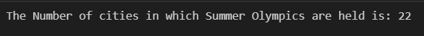
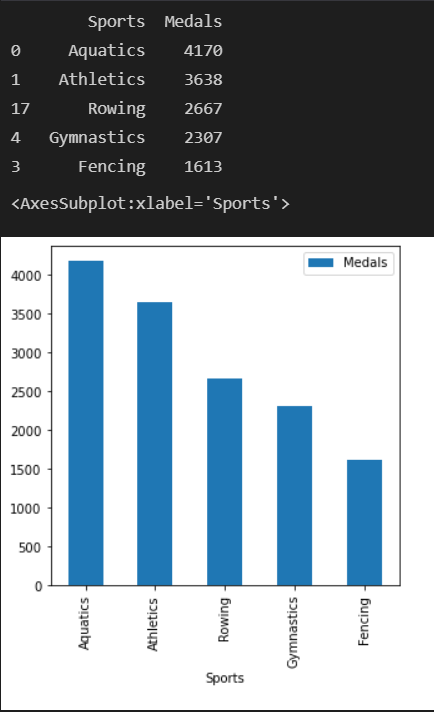
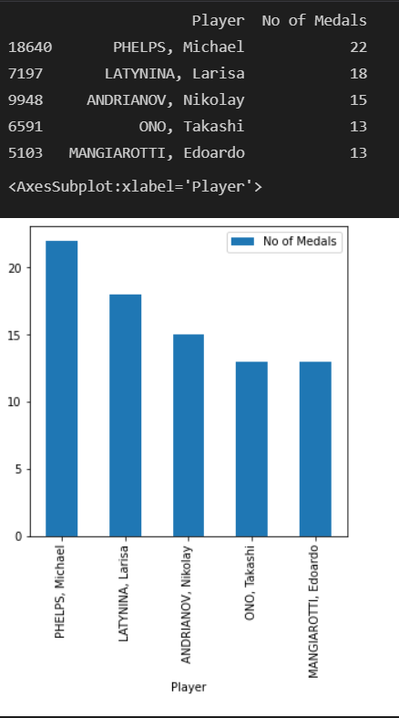
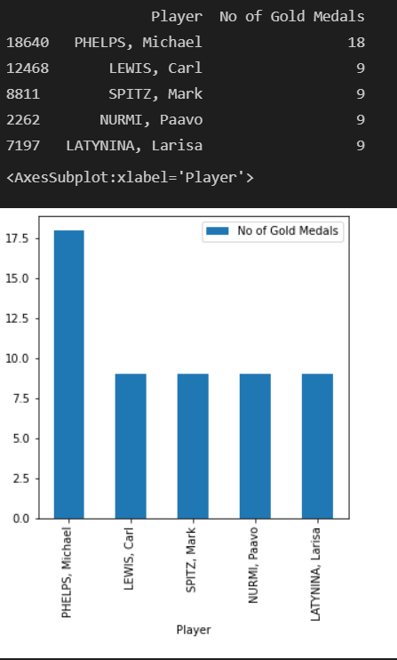
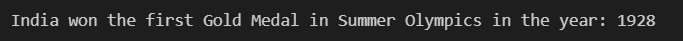
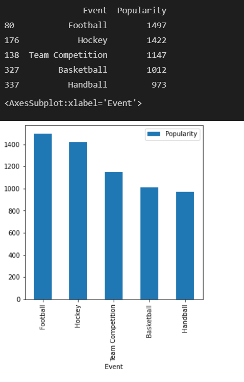
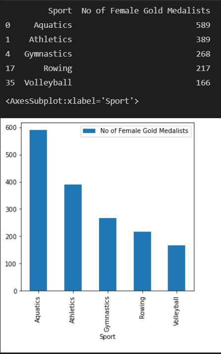

This repository contains the "Summer OLympics DataSet Analysis" Assignment Solution with Codes and Outputs

1. In how many cities Summer Olympics is held so far?

Output:

2. Which sport is having most number of Gold Medals so far? (Top 5)

Output:

3. Which sport is having most number of medals so far? (Top 5)

Output:

4. Which player has won most number of medals? (Top 5)

Output:

5. Which player has won most number Gold Medals of medals? (Top 5)

Output:

6. In which year India won first Gold Medal in Summer Olympics?

Output:

7. Which event is most popular in terms on number of players? (Top 5)

Output:

8. Which sport is having most female Gold Medalists? (Top 5)

Output:

